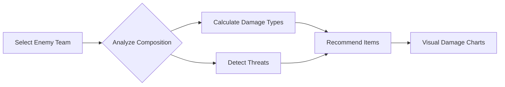

<div align="center">

<!-- Animated Title -->


<p align="center">
  
  
  
</p>

<p align="center">
  
  
  
  
</p>

<h3>🎮 The Ultimate League of Legends Analytics & Counter-Building Platform 🎮</h3>

<p>
  <a href="#-features">Features</a> •
  <a href="#-showcase">Showcase</a> •
  <a href="#-tech-stack">Tech Stack</a> •
  <a href="#-quick-start">Quick Start</a> •
  <a href="#-math-engine">Math Engine</a>
</p>

<a href="https://lol-matrix.vercel.app" target="_blank">
  
</a>

---

</div>

## 🔥 What is LoL-Matrix?

<div align="center">

```ascii
╔══════════════════════════════════════════════════════════════╗
║                                                              ║
║   🎯 ANALYZE  •  📊 CALCULATE  •  ⚔️ DOMINATE  •  🏆 WIN   ║
║                                                              ║
╚══════════════════════════════════════════════════════════════╝
```

</div>

**LoL Matrix** is a cutting-edge web application that gives you the competitive edge in League of Legends. Built with real-time data from Riot's Data Dragon API, it provides comprehensive champion analytics, intelligent counter-building recommendations, and precise damage calculations.

<table>
<tr>
<td width="50%">

### 🎯 For Casuals
- Instant champion counters
- Easy-to-read stats
- Visual damage breakdowns
- Simple item recommendations

</td>
<td width="50%">

### 🏆 For Tryhards
- Frame-perfect calculations
- Level-by-level stat curves
- Optimal build paths
- Advanced damage formulas

</td>
</tr>
</table>

---

## ✨ Features

<div align="center">

### 📊 Champion Analytics Dashboard


</div>

<details open>
<summary><b>🔍 Click to expand Champion Features</b></summary>

<br>

| Feature | Description | Status |
|---------|-------------|--------|
| 🖼️ **High-Res Splash Arts** | Official Riot artwork for every champion | ✅ Live |
| 📈 **Dynamic Stats** | Real-time calculations from level 1-18 | ✅ Live |
| 🎯 **Win Rate Data** | Up-to-date pick/ban/win rates | ✅ Live |
| 🏅 **Tier Rankings** | S/A/B/C tier classifications | ✅ Live |
| 🔎 **Role Filtering** | Filter by Top/Jungle/Mid/ADC/Support | ✅ Live |

</details>

---

<div align="center">

### 🛡️ Intelligent Counter Builder


</div>

<details open>
<summary><b>⚔️ Click to expand Counter Builder Features</b></summary>

<br>

The Counter Builder analyzes enemy team composition and recommends optimal items:



#### 🧠 Smart Detection System

- **💀 High Burst Damage?** → Recommends Sterak's, Guardian Angel, Stopwatch
- **💚 Heavy Healing?** → Suggests Thornmail, Morellonomicon, Executioner's
- **🛡️ Tank Heavy?** → Prioritizes Void Staff, Lord Dom's, Black Cleaver
- **⚡ Mixed Damage?** → Balances resistances (MR + Armor)
- **🎯 Squishy Targets?** → Maximizes damage output items

#### 📊 Visual Damage Distribution

Shows percentage breakdown:
- **Physical Damage** (Red)
- **Magic Damage** (Blue)  
- **True Damage** (White)

</details>

---

<div align="center">

### 🧮 Advanced Damage Calculator


</div>

<details open>
<summary><b>📐 Click to expand Calculator Features</b></summary>

<br>

#### Physical Damage System
```javascript
finalDamage = rawDamage × (100 / (100 + effectiveArmor))
effectiveArmor = armor × (1 - armorPenPercent) - lethality
```

- ⚔️ Raw damage input
- 🛡️ Armor calculations
- 📉 Armor penetration (% and flat)
- 🎯 Lethality scaling by level

#### Magic Damage System
```javascript
finalDamage = rawDamage × (100 / (100 + effectiveMR))
effectiveMR = mr × (1 - magicPenPercent) - flatMagicPen
```

- 🔮 Magic damage calculations
- 🔰 Magic resist formulas
- ✨ Magic penetration (% and flat)
- 💫 Void Staff interactions

#### Advanced Metrics
- **💪 Effective HP**: `HP × (1 + Armor/100)`
- **⚡ DPS Calculator**: Auto-attacks with crit damage
- **📈 Damage vs Level Graphs**: Visual scaling curves
- **🎯 Breakpoint Analysis**: Find optimal stat thresholds

</details>

---

<div align="center">

### 🗡️ Complete Item Database


</div>

<details>
<summary><b>💎 Click to expand Item Database Features</b></summary>

<br>

- 🖼️ **Official Item Icons** from Data Dragon
- 💰 **Cost & Gold Efficiency** calculations  
- 📋 **Complete Descriptions** with passive/active effects
- 🔢 **All Item Stats** (AD, AP, HP, Armor, MR, etc.)
- 📊 **Sorted by Price** for easy build planning
- 🔄 **Auto-Updates** with each new patch

</details>

---

## 🎬 Showcase

<div align="center">

<table>
<tr>
<td align="center" width="50%">
  
  <br><br>
  <sub>Browse all 172 champions with stats, roles, and tier rankings</sub>
</td>
<td align="center" width="50%">
  
  <br><br>
  <sub>Get personalized item recommendations against enemy teams</sub>
</td>
</tr>
<tr>
<td align="center" width="50%">
  
  <br><br>
  <sub>Calculate exact damage with armor pen, MR, and resistances</sub>
</td>
<td align="center" width="50%">
  
  <br><br>
  <sub>Complete item list with stats, costs, and descriptions</sub>
</td>
</tr>
</table>

</div>

---

## 🚀 Tech Stack

<div align="center">

<table>
<tr>
<td align="center" width="25%">
  
  <br><sub><b>React 18</b></sub>
  <br><sub>Modern UI Framework</sub>
</td>
<td align="center" width="25%">
  
  <br><sub><b>Vite</b></sub>
  <br><sub>Lightning-Fast Build</sub>
</td>
<td align="center" width="25%">
  
  <br><sub><b>Tailwind CSS</b></sub>
  <br><sub>Utility-First Styling</sub>
</td>
<td align="center" width="25%">
  
  <br><sub><b>Recharts</b></sub>
  <br><sub>Data Visualization</sub>
</td>
</tr>
<tr>
<td align="center" width="25%">
  
  <br><sub><b>Data Dragon</b></sub>
  <br><sub>Official Riot CDN</sub>
</td>
<td align="center" width="25%">
  
  <br><sub><b>Vercel</b></sub>
  <br><sub>Zero-Config Deploy</sub>
</td>
<td align="center" width="25%">
  
  <br><sub><b>JavaScript</b></sub>
  <br><sub>Core Language</sub>
</td>
<td align="center" width="25%">
  
  <br><sub><b>GitHub</b></sub>
  <br><sub>Version Control</sub>
</td>
</tr>
</table>

</div>

---

## 🧮 Math Engine

<div align="center">

```javascript
╔════════════════════════════════════════════════════╗
║          🔬 PRECISION MATH ENGINE 🔬              ║
╚════════════════════════════════════════════════════╝
```

</div>

The heart of LoL-Matrix is its **frame-perfect damage calculation engine**:

### ⚔️ Physical Damage
```javascript
MathEngine.calcPhysicalDamage(
  rawDamage,      // Base damage
  armor,          // Target armor
  armorPenPercent, // % armor pen (0-1)
  lethality,      // Flat armor pen
  level           // For lethality scaling
)
```

### 🔮 Magic Damage
```javascript
MathEngine.calcMagicDamage(
  rawDamage,      // Base magic damage
  mr,             // Target magic resist
  magicPenPercent, // % magic pen (0-1)
  flatMagicPen    // Flat magic pen
)
```

### 💪 Effective HP
```javascript
MathEngine.calcEffectiveHP(
  hp,             // Current HP
  resistance      // Armor or MR
)
// Returns: How much raw damage needed to kill
```

### ⚡ DPS Calculations
```javascript
MathEngine.calcDPS(
  ad,                  // Attack damage
  attackSpeed,         // Attacks per second
  critChance,          // Crit chance (0-1)
  critDamageMultiplier // Usually 2.0 (200%)
)
```

### 📈 Stat Scaling
```javascript
MathEngine.statAtLevel(
  base,       // Base stat value
  perLevel,   // Growth per level
  level       // Current level (1-18)
)
// Formula: base + (perLevel × (level - 1))
```

---

## 🌐 Data Dragon Integration

<div align="center">

All game data comes directly from **Riot's Official CDN**:

</div>

### 🔗 API Endpoints

| Resource | Endpoint |
|----------|----------|
| 📦 **Versions** | `https://ddragon.leagueoflegends.com/api/versions.json` |
| 🎮 **Champions** | `https://ddragon.leagueoflegends.com/cdn/{version}/data/en_US/champion.json` |
| ⚔️ **Items** | `https://ddragon.leagueoflegends.com/cdn/{version}/data/en_US/item.json` |
| 🔮 **Runes** | `https://ddragon.leagueoflegends.com/cdn/{version}/data/en_US/runesReforged.json` |

### 🖼️ Image Assets

```javascript
// Champion Icon
`https://ddragon.leagueoflegends.com/cdn/{version}/img/champion/{ChampionId}.png`

// Champion Splash Art
`https://ddragon.leagueoflegends.com/cdn/img/champion/splash/{ChampionId}_0.jpg`

// Item Icon
`https://ddragon.leagueoflegends.com/cdn/{version}/img/item/{itemId}.png`
```

### 🔄 Auto-Update System

```javascript
import { DataDragon } from './utils/api';

// Check for new patches
const { hasUpdate, latestVersion } = await DataDragon.checkForUpdate(currentVersion);

if (hasUpdate) {
  // Fetch latest data
  const champions = await DataDragon.getChampions(latestVersion);
  const items = await DataDragon.getItems(latestVersion);
}
```

---

## 🚀 Quick Start

<div align="center">

### Get Started in 60 Seconds ⚡

</div>

```bash
# 1️⃣ Clone the repository
git clone https://github.com/MisTAiM/LoL-Matrix.git

# 2️⃣ Navigate to project
cd lol-matrix

# 3️⃣ Install dependencies
npm install

# 4️⃣ Start development server
npm run dev

# 5️⃣ Open browser
# Navigate to http://localhost:5173
```

### 📦 Available Scripts

```bash
npm run dev      # Start development server
npm run build    # Build for production
npm run preview  # Preview production build
npm run lint     # Run ESLint
```

---

## 📁 Project Structure

```
lol-matrix/
│
├── 📂 src/
│   ├── 📄 App.jsx                    # Main application component
│   ├── 📄 main.jsx                   # Entry point
│   │
│   ├── 📂 components/
│   │   ├── 🎮 ChampionOverview.jsx   # Champion grid & filters
│   │   ├── ⚔️ CounterBuilder.jsx     # Item recommendations
│   │   ├── 🧮 DamageCalculator.jsx   # Damage formulas
│   │   └── 🗡️ ItemDatabase.jsx       # Item browser
│   │
│   ├── 📂 data/
│   │   ├── 📊 champions_full.json    # All 172 champions (Data Dragon)
│   │   └── 💎 items_full.json        # All items (Data Dragon)
│   │
│   ├── 📂 utils/
│   │   ├── 🔧 api.js                 # Data Dragon API client
│   │   ├── 🧮 mathEngine.js          # Damage calculations
│   │   └── 🎯 counterLogic.js        # Item recommendation AI
│   │
│   └── 📂 assets/
│       └── 🎨 styles.css             # Global styles
│
├── 📂 public/
│   └── 🖼️ images/
│
├── 📄 package.json
├── 📄 vite.config.js
├── 📄 tailwind.config.js
├── 📄 index.html
└── 📄 README.md
```

---

## 🎯 Roadmap

<div align="center">

### 🚧 Coming Soon 🚧

</div>

- [ ] 🔥 **Rune Recommendations** - Optimal rune pages for matchups
- [ ] 📊 **Build Path Analytics** - Most popular builds per champion
- [ ] 🎮 **Matchup Database** - Champion vs Champion win rates
- [ ] 🌍 **Multi-Language Support** - Internationalization
- [ ] 📱 **Mobile App** - React Native version
- [ ] 🤖 **Discord Bot** - Quick stats in Discord
- [ ] 🏆 **Rank Tracking** - Integrate with Riot API for personal stats
- [ ] 🎬 **Replay Analysis** - Upload and analyze your games

---

## 🤝 Contributing

<div align="center">

**We welcome contributions!** 

Found a bug? Have a feature idea? Want to improve the math?

<a href="https://github.com/MisTAiM/LoL-Matrix/issues/new">
  
</a>
<a href="https://github.com/MisTAiM/LoL-Matrix/issues/new">
  
</a>

</div>

### 📝 How to Contribute

1. **Fork** the repository
2. Create a **feature branch** (`git checkout -b feature/AmazingFeature`)
3. **Commit** your changes (`git commit -m 'Add some AmazingFeature'`)
4. **Push** to the branch (`git push origin feature/AmazingFeature`)
5. Open a **Pull Request**

---

## 📜 License

<div align="center">

```
MIT License - Do Whatever You Want!
```

[](https://opensource.org/licenses/MIT)

**Not affiliated with Riot Games, Inc.**

*League of Legends and Riot Games are trademarks or registered trademarks of Riot Games, Inc.*

</div>

---

## 💖 Support

<div align="center">

**If LoL-Matrix helped you climb the ranks, consider:**

<a href="https://github.com/MisTAiM/LoL-Matrix">
  
</a>
<a href="https://twitter.com/intent/tweet?text=Check%20out%20LoL-Matrix!%20%F0%9F%8E%AE&url=https://github.com/MisTAiM/LoL-Matrix">
  
</a>

</div>

---

<div align="center">

### 🎮 Built for summoners, by summoners 🎮

**[Live Demo](https://lol-matrix.vercel.app)** | **[Report Bug](https://github.com/MisTAiM/LoL-Matrix/issues)** | **[Request Feature](https://github.com/MisTAiM/LoL-Matrix/issues)**


**Made with 🔥 and ☕ by [Morpheus](https://github.com/MisTAiM)**

</div>
